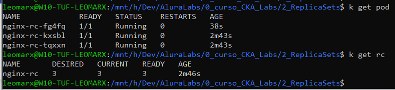

# Anotações Curso-Alura-Udemy

-in each folder you can run the labs

# Principais Comandos
- k get ns;k get po;k get no;k get rs;k get rc;k get svc;k get hpa;k get ing;k get deploy;

- kubectl api-resources
- kubectl get pods -o wide --all-namespaces
- kubectl get po -o wide -n workshop --show-labels
- kubectl logs nginx -n workshop
- kubectl port-forward nginx 8080:80
- http://localhost:8080

#Lab01
auto generating YAML = Geração automática de YAML ao fazer run direto.
- Full
- k run nginx --image=nginx -o yaml > nginxAutoGeneratedFull.yaml
- Short
- k run nginx --image=nginx --dry-run=client -o yaml > nginxAutoGeneratedShort.yaml

#Lab02
A deployment with ReplicaSet is new way recomended
O selector: app deve ser igual ao labels: app
Dentro do spec deve ter replicas, selector, template

# Comandos Secundários
k config get-contexts;k get pv;k get pvc;k get ev;k get jobs;k get cj;k get limits;k get quota;